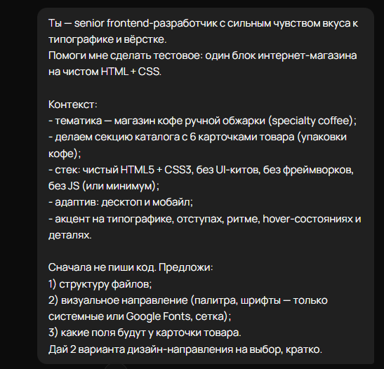
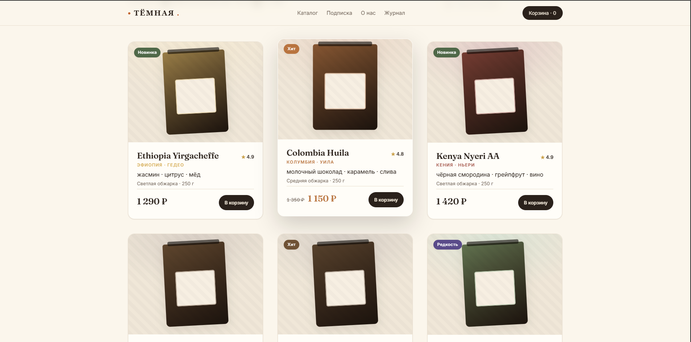

# ☕ ТЁМНАЯ — лендинг specialty-кофе

Адаптивный лендинг обжарочной кофе ручной обжарки: hero-секция и каталог
из 6 карточек товара. Чистый **HTML5 + CSS3**, без UI-китов и фреймворков.

🔗 **Демо:** https://m00n77.github.io/coffee_shop/




---

## ✨ Особенности

- **Чистый стек** — HTML5 + CSS3, ноль зависимостей и фреймворков.
- **Адаптив** — сетка карточек 3 / 2 / 1 (десктоп / планшет / мобайл),
  плавная типографика через `clamp()`.
- **Дизайн-система на токенах** — палитра, типографическая шкала, отступы,
  радиусы и тени вынесены в CSS custom properties.
- **Микро-взаимодействия** — hover-состояния карточек и кнопок, анимация пара
  в hero, аккуратные transition без «прыжков» layout.
- **Доступность** — семантическая разметка, `:focus-visible`, `aria-label`,
  контраст текста ≥ AA, поддержка `prefers-reduced-motion`.
- **Детали** — нарисованные CSS/SVG-пакеты кофе, грейн-текстура фона,
  табличные цифры в ценах, редакторская типографика (Fraunces + Inter).

---

## 🛠 Технологии

- HTML5 (семантическая разметка)
- CSS3 — Grid, Flexbox, custom properties, `clamp()`, `color-mix()`, `aspect-ratio`
- Google Fonts — Fraunces, Inter

---

## 🚀 Запуск локально

Дополнительная сборка не требуется — просто откройте `index.html` в браузере:

```bash
git clone https://github.com/M00N77/coffee_shop.git
cd coffee_shop
# открыть index.html в браузере
```
